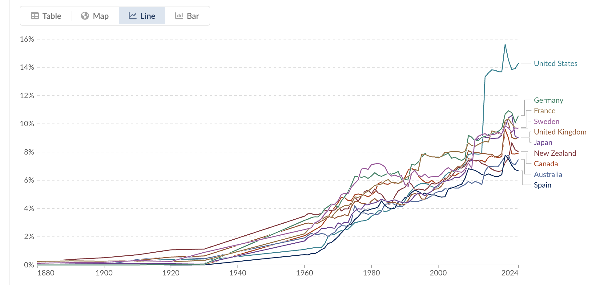
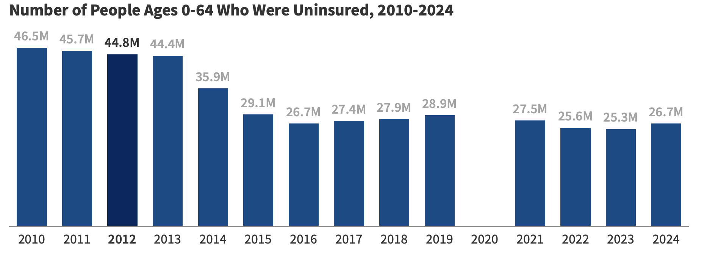
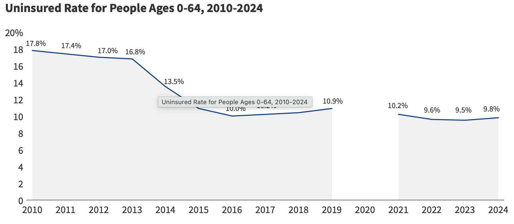

---
format:
  revealjs:
    theme: styles.scss
    transition: fade
    slide-number: true
    wide: true
    chalkboard: true
    margin: 0.1
    footer: "Introduction to Health Economics | Fall 2026 | Session 4"
    controls: true
---

::: {.title-slide}

# Medical care markets: Market failures and government interventions

<br>


Wu Zeng, MD, PHD

<br>

Associate Professor

Department of Global Health

Georgetown University

`wz192@georgetown.edu`

<br>

[Claimer]{.themec}: I declares no conflict of interest

:::

---
```{r setup, include=FALSE}

knitr::opts_chunk$set(echo = FALSE, warning = FALSE, message = FALSE, 
  comment = NA, dpi = 300, fig.align = "center", out.width = "80%", cache = FALSE)
library(tidyverse)

```

## Outline 


- Review of last session
- Market for the health sector
- Health spending, access and quality
- Market failure in the health sector

---

## Circular flow of economy

<center>


</center>

--- 

## Demand and supply

:::: columns
::: {.column width="50%"}

- Law of demand
- Factors shifting the demand curve
  - Income
  - Price of related goods
  - Tastes (preference)
  - Expectations
  - Number of buyers
- Price Elasticity: measurement of
    responsiveness of demand to price
    change

:::
::: {.column width="50%"}
- Law of supply
- Factors shifting the supply curve
  - Input prices
  - Technology
  - Expectations about future
  - Number of sellers
:::
::::

---

## Equilibrium

- Definition

- Implications in the free market model

---

## Competitive market

::::columns
::: {.column width="50%"}

- Conditions
  - Many buyers and sellers
  - A standardized product
  - Mobile resources (free enter and exit the market)
  - Perfect information
:::

:::{.column width="50%"}
- Implications
  - Individual firms and comsumers are price takers. 
  - The price is jointly determined by the market. 
:::
::::


<center>


</center>


---

## Firm production {visibility="hidden"}

- Objective: Maximize profit = total benefits - total costs
- Benefits: Diminishing marginal benefit
- Costs: Increasing marginal cost
- Profit is maximized when marginal   benefits = Marginal costs.

---

## Welfare and government interventions

::: {.columns}
::: {.column width="50%"}

- Welfare: It is the sum of consumer surplus and producer surplus
  - Price control and taxation can reduce welfare

- Government interventions
  - Price control
  - Taxation

:::

::: {.column width="50%"}
```{r echo=FALSE, fig.width=6, fig.height=6}
dta1 <- data.frame(x = c(0,0,50,0), y = c(0,400,400,0))

supply1 <- ggplot(data.frame(x=c(0,100)),aes(x=x)) + 
  annotate("segment", x = 0, xend = 100, y = 0, yend = 800) + 
  scale_y_continuous(limits = c(0,800), breaks = seq(0, 800, by = 100)) +
  labs(x = "Quantity", y = "Price") +
   theme_classic() +
  theme(text = element_text(size=20),axis.ticks.length = unit(-2, "mm")) 

dta2 <- data.frame(x=c(0,0,50),y=c(400,600,400))
equi1 <- supply1 +
  annotate("segment", x= 0 , xend= 100 , y= 600 , yend = 200, color = "red")   + 
  annotate("text", x = 100, y= 700, label = "S", size =8) +
  annotate("text", x = 100, y= 150, label = "D", size =8)

equi1 +
  annotate("segment", x=0, xend=50, y=400, yend=400, linetype = 2, color="red") +
  annotate("segment", x=50, xend=50, y=0, yend=400, linetype = 2, color="red") +
  geom_polygon(aes(x, y), data=dta1, fill = "red", alpha = 0.2) +
  geom_polygon(aes(x, y), data=dta2, fill = "purple", alpha = 0.2) +
  theme(axis.text.x=element_blank(),
      axis.text.y=element_blank())

```

:::

:::


---

## What about medical care market?

---

## Debate on US health care system

<center> 

<iframe width="879" height="495" src="https://www.youtube.com/embed/jmOPWRyblMU" title="Serious Debate Begins on US Health Care System" frameborder="0" allow="accelerometer; autoplay; clipboard-write; encrypted-media; gyroscope; picture-in-picture; web-share" referrerpolicy="strict-origin-when-cross-origin" allowfullscreen></iframe>

</center>

---

## Competitive markets 

:::: columns
::: {.column width="50%"}

[Conditions]{.themec} of competitive market 

- Producers

  - Face [competition]{.themec}
  
  - Face no barriers to [entry or exit]{.themec}

- Consumers: 
  
  - Are [perfectly informed]{.themec} of benefits and prices of all goods
  
  - Bear [all costs]{.themec} and receive all benefits (No [externalities]{.themec})
  
- There are no [public Good]{.themec} characteristics 

- Products are [identical]{.themec} (price is only factor)

:::

:::{.column width="50%"}

### Efficient market presented in health care?

- Lack of competition (monopoly, oligopoly)
- Goods characteristics
  - Externalities
  - Public Goods
- Uncertainty (insurance market, payment models)
- Imperfect information (e.g.,supplier induced demand, moral hazard and adverse selection) 
- Barriers to entry

:::
::::

---

## Government intervention to address market failure 

- Regulations

  - e.g., Price control 

- Financial incentives 

  - Taxation 

  - Subsidy 

---

## Medical care market {visibility="hidden"}

- To use economics to assess health care, must accept the premise that a market in medical care can function effectively.
- But medical care differs in significant ways:
  - Unpredictability
  - Asymmetric information
  - Trust
  - Barriers to entry
  - Payment practices (Insurance)

---

## Views on government involvement in medical care

:::: columns 
:::{.column width="50%"}

### Some [favor]{.themec} government involvement in medical care

- Medicine is too complicated to be left to market forces
- Medicine difficult to understand; patents must rely on doctors
- Medical care is a social good, too important for the impersonal marketplace
- Externalities in medicine, especially infectious diseases, require collective action to protect society
- Provision of medical care based on the ability to pay is morally repugnant
:::
:::{.column width="50%"}

### Some [oppose]{.themec} government involvement in medical care

- U.S. system has remained mostly market-based
- This is evidence of deep American distrust of federal government involvement in health care matters
- Experience: government-run programs are costly

:::
::::

---

## Triple aim of a health system {.center}

<br> <br>

<center>

### Provide good [access]{.themec} to [high-quality]{.themec} medical care at [affordable prices]{.themec}

</center>

---

## Health care spending

A major factor driving health care reform debate is spending, including total spending, spending per person, and as a share of total economic output

:::: columns
::: {.column width="50%"}
- Hospital care
- Physicians’ services
- Prescription drugs, other medical products
- Other personal health care spending
:::
::: {.column width="50%"}

<center>


</center>

:::
::::

---

## Prospects of future

::::columns 
:::{.column width="50%"}
- United States spends more on medical care and devotes a larger percentage of economic output to medical care than any other country in the world
  - US: 17% of GDP in 2023 in comparison to 10% in Canada, 11% in Germany, and 12% in France
- What is a reasonable percentage of output to devote to medical care spending? 
- Are we getting our money’s worth? How much can we afford? (discussion)
:::

:::{.column width="50%"}

<center>



</center>

:::
::::

---

## Access to care (need new data)

<center>



<br>



</center>

--- 

## Medical outcomes 

- Relative poorer health outcomes 
  - Life expectancy
  - Infant and maternal mortality rate 
- High incidence 
  - Drug abuse 
  - violence
  - Obesity
  - etc. 

---

## Underlying factors driving spending

- National spending has slowed considerably over the past decade
- 2001–2007: spending grew at an annual rate of 7.5%
- 2008–2013: spending rate slowed down to 3.8%
- The role played by the ACA in this slowdown has been controversial
- Possible factors include:
  - Great Recession
  - Temporary decline in the introduction of new medical technologies
  - Increase in patient cost sharing in the form of higher deductibles and copays

---

## The competitive market model

- [Efficiency]{.themec} is the core
  - Technical efficiency
  - Allocative efficiency
- Adam Smith
  - Individual decision-making is motivated by [self-interest]{.themec}
  - Guided by the “invisible hand” of the market, this self-serving behavior serves to promote the interests of others
  - In a perfectly competitive market, optimizing behavior by firms and individuals leads to [efficient]{.themec} outcomes
  - Modern day economists evaluate markets by efficiency and equity

---

## Market failures {visibility="hidden"}

:::: colulmns
::: {.column width="50%"}
- Market failure
    - Markets fail to allocate resources optimally
        - when firms have [market power]{.themec}, 
        - when there are [externalities]{.themec} in consumption and production, 
        - when the good produced is a [public good]{.themec}.
        - when there is [asymmetric information]{.themec} between buyers and sellers
- Market power
    - Market power is depicted graphically by any [departure]{.themec} from perfectly elastic demand curves
:::
:::{.column width="50%"}

<center> 


</center>

:::
::::

---

## Market failure in medical markets: Reasons

:::: colulmns
::: {.column width="50%"}
- Lack of competition (monopoly, oligopoly)
- Goods characteristics
  - Externalities (merit goods)
  - Public goods
- Uncertainty (insurance market, payment models)
- Imperfect information (e.g.,supplier induced demand, moral hazard and adverse selection) 
- Barriers to entry
:::
:::{.column width="50%"}


:::

::::

--- 

## Market failure in medical markets {visibility="hidden"}

- Traditional Sources of Market failure
  - Monopolies- (in small and rural communities, little competition; in larger, some have market power)
  - Externalities- (modern society is a breeding ground for communicable diseases))
  - Is medical care a public good, nonexcludable in distribution and nonrival in consumption?
- Imperfections in Medical Markets
  - Imperfect Information
  - Price Transparency
  - Barriers to Entry
  - Third-Party Payers

--- 

## Market failures {visibility="hidden"}

- Markets sometimes fail to allocate resources efficiently due to:
- Market power
    - Supply side
    - Demand side
- Externalities
  - Negative
  - Positive
- Public goods
  - Nonexcludable
  - Non-rival

---

## Market failure 1: Natural monopoly or monoposony (Single purchase of inputs)

:::: columns
::: {.column width="50%"}

- Competitive market assumed 
  - Competition
  - Many sellers (providers)
- Medical care 
  - Few sellers (e.g., hospitals): barriers to entry (e.g., licensing)
  - Monopoly or oligopoly (e.g., pharmaceutical companies)
:::
:::{.column width="50%"}

- Means to address monopoly
  - Regulations 
    - [Price controls]{.themec}  
    - Entry restrictions 
    - Limits on new product development 
    - Enforce antitrust laws   
  - Tax policy 

<center> 


</center>

:::
::::

---

## Market failure 2: Public goods

:::: columns
::: {.column width="50%"}

- Markets distribte goods efficiently, when
  - When people spend their own money to enjoy the benefits of consumption
  - When non-purchasers are excluded from the benefits of consumption (avoid free riders)
- But in some situations, these rules do not apply
  - Public goods
    - [Nonexcludable]{.themec} and 
    - [nonrival]{.themec} (e.g. national defense, air traffic control)
:::
:::{.column width="50%"}

- ### Means to correct market failure
  - Government provision of public goods
  - Taxation to finance public goods
  - Subsidies
  - Mandatory regulations

:::
::::

. . .

- Is [health care]{.themec} a [public good]{.themec}? Why or why not?

---

## Debate on health care system 

<center> 

<iframe width="880" height="495" src="https://www.youtube.com/embed/PYWrUbc9F8U" title="Is Health Care a Right? || Debate Clip" frameborder="0" allow="accelerometer; autoplay; clipboard-write; encrypted-media; gyroscope; picture-in-picture; web-share" referrerpolicy="strict-origin-when-cross-origin" allowfullscreen></iframe>

</center>

---

## Merit goods 

- Definition: Merit goods are goods that are under-consumed in a free market because people do not fully appreciate the benefits of consuming them.

- Examples: Vaccinations, education, and health care

---

## Market failure 3: Externalities

::::columns 
::: {.column width="50%"}

- Definition: An externality is a [cost]{.themec} or a [benefit]{.themec} arising from an economic transaction that falls on people who do not participate in the transaction
  - A benefit in this case is called a [positive externality]{.themec} or [external benefit]{.themec}.
    - Vaccine against contagious diseases
  - A cost is called a [negative externality]{.themec} or [external cost]{.themec}.
    - A factory that dumps toxic waste into a river
- Policy issue – design of appropriate institutions, legislation and regulation to align individual [incentives]{.themec} and social welfare

:::
:::{.column width="50%"}

:::{.panel-tabset}
### Positive externality in consumption

<center>


</center>

### Negative externality in consumption

<center>


</center>

:::

:::
::::


---

## Positive externality

:::: columns
::: {.column width="50%"}

- Private benefit

  - [Direct benefit]{.themec} to [consumers]{.themec} who buy and consume good

- Social benefit
  
  - [Indirect benefit to all]{.themec} in society, including those who do not consume it
  
      - Vaccination (herd immunity effect)
      
      - ‘Caring externality’ – others in society care that other people might not be able to receive treatment
      
  - Cause market failure (too little consumption)
    
      - Demand curve = ‘marginal private benefit’ (MPB)
  
      - But, where positive externalities exist, additional ‘marginal social benefits’ (MSB)
:::
:::{.column width="50%"}

<center>


</center>

:::
::::
        
---

## Externality leads to market failure 

:::: colulmns
::: {.column width="50%"}

### Why? 

-  Where externalities exist, the price mechanism does [not]{.themec} result in allocative efficiency, therefore market failure.

- With positive externalities people that would benefit are not buying the product

- Therefore there is under supply of product and [‘deadweight']{.themec} social loss

### Government interventions 

  - Subsidy/Tax 
  
  - Regulations of quantity produced 
:::

:::{.column width="50%"}

<center>


</center>

:::
:::: 

---

## Subsidy to vaccination

<center> 

<iframe width="950" height="495" src="https://www.youtube.com/embed/Aqlk5OptiZM" title="Subsidies to encourage more Singaporeans to get vaccinated" frameborder="0" allow="accelerometer; autoplay; clipboard-write; encrypted-media; gyroscope; picture-in-picture; web-share" referrerpolicy="strict-origin-when-cross-origin" allowfullscreen></iframe>

---

## Market failure 4: Asymmetry of information

- Definition: 

  - [Asymmetry of information]{.themec} exists when one person in an economic transaction has more relevant information than the other person. 

- In health care settings, asymmetry of information raises three issues: 

- In the medical care market, it leads to 

  - [Supplier-induced demand]{.themec}: Patients have little information and have to rely on physicians’ advice

- in the health insurance market, it leads to 

  - [Adverse selection]{.themec}
  
  - [Moral hazard]{.themec}

--- 

## Hospital Price Transparency Rule

<center> 

<iframe width="950" height="495" src="https://www.youtube.com/embed/xVlIa7bWfGw" title="Understanding the Hospital Price Transparency Rule" frameborder="0" allow="accelerometer; autoplay; clipboard-write; encrypted-media; gyroscope; picture-in-picture; web-share" referrerpolicy="strict-origin-when-cross-origin" allowfullscreen></iframe>

</center>

---

## Supply induced demand {visibility="hidden"}

:::: columns
::: {.column width="50%"}

- Definition: Increased .themec[demand] as a result of a provider (e.g. a doctor) exploiting
an asymmetry of information. 

  - More generally, observation that when faced with shock to equilibrium (e.g., .themec[increase supply]), health providers may respond by .themec[‘inducing demand’] (shift demand curve) for their services

- It is also an agent problem

  - In practice, health providers (like other human beings!) are not perfect at putting the interests of others before their own .themec[interests]

- Why does it lead to inefficiency: 

  - .themec[Unnecessary use] of medical services for consumers
:::

:::{.column width="50%"}

:::{.panel-tabset}

### Supply+

<center> 


</center>


### Demand+

<center> 


</center>

### Supply++

<center> 


</center>

:::
:::
::::

---

## Moral hazard {visibility="hidden"}

:::: columns
::: {.column width="50%"}

- Definition: Moral hazard occurs anytime there is an opportunity to gain from acting differently
from the implied principles of a contract

  - .themec[The contract changes consumer’s behaviors]

- Because private actions are hidden from view, both parties have an opportunity to gain from unpredictable behavior

- Having insurance:

  - Increases the likelihood of purchasing medical services
  
  - Induces higher spending in the event of illness
::: 

::: {.column width="50%"}

### Potential loss from moral hazard

<center> 


</center>

:::
:::: 

---

## Moral Hazard {visibility="hidden"}

<center>

<iframe width="850" height="495" src="https://www.youtube.com/embed/keOJX7JObvI" title="Health Care Economics:  Ankle MRI" frameborder="0" allow="accelerometer; autoplay; clipboard-write; encrypted-media; gyroscope; picture-in-picture; web-share" referrerpolicy="strict-origin-when-cross-origin" allowfullscreen></iframe>

---

## User fees and moral hazard {visibility="hidden"}

:::: columns
::: {.column width="50%"}

 - User charges (co-payments) can be viewed as a means of reducing moral hazard

  - Reduces utilization of health care by patients

- But there are problems:

  - Disproportionately affects lower income groups

  - Demand is reduced for effective treatments as well as trivial health care

  - May not reduce consumption if doctors induce demand
:::

:::{.column width="50%"}


<iframe width="450" height="300" src="https://www.youtube.com/embed/kAKQ6TYzc-I" title="Why user fees won&#39;t make our health system more affordable, featuring Dr. Raisa Deber" frameborder="0" allow="accelerometer; autoplay; clipboard-write; encrypted-media; gyroscope; picture-in-picture; web-share" referrerpolicy="strict-origin-when-cross-origin" allowfullscreen></iframe>

:::
:::: 
 
---

## Adverse selection {visibility="hidden"}

:::: columns
::: {.column width="50%"}

- Adverse selection arises because

  - Individuals may have .themec[better information] of their risk status than does the insurance company

  - Individuals with a low risk of requiring health care may find it difficult to obtain ”actuarially fair” insurance – premium equal to expected cost of future consumption

  - Those with .themec[lower risk] will .themec[not purchase insurance] priced to cater for those with
average risk, whereas higher risk individuals will, SO…

:::
:::{.column width="50%"}

- … average risk level of those remaining will
rise (as will premium) (continually)

- Result: those at .themec[low risk] (and high risk with
low income) .themec[not insured] (as premium rises)

- Solutions:

  - Private insurance may .themec[‘experience rate’] (set a
different premium for different risk groups)

  - Compulsory .themec[public insurance]. Stops low risk
leaving market (forced cross-subsidisation of
those at high risk by those at low risk)
:::
::::

---

## Government failure 

- Definition: Government failure occurs when government intervention in the market causes a more inefficient allocation of resources and a decline in economic welfare.

- Government failure is common 

- Examples: 

  - Price controls (e.g., rent control, minimum wage)
  
  - Subsidies (e.g., agricultural subsidies)
  
- Whetehr efficiency and fairness are best addressed by impperfect government or imperfect markets is a matter of debate

---

## Questions and commments ? {.center}
